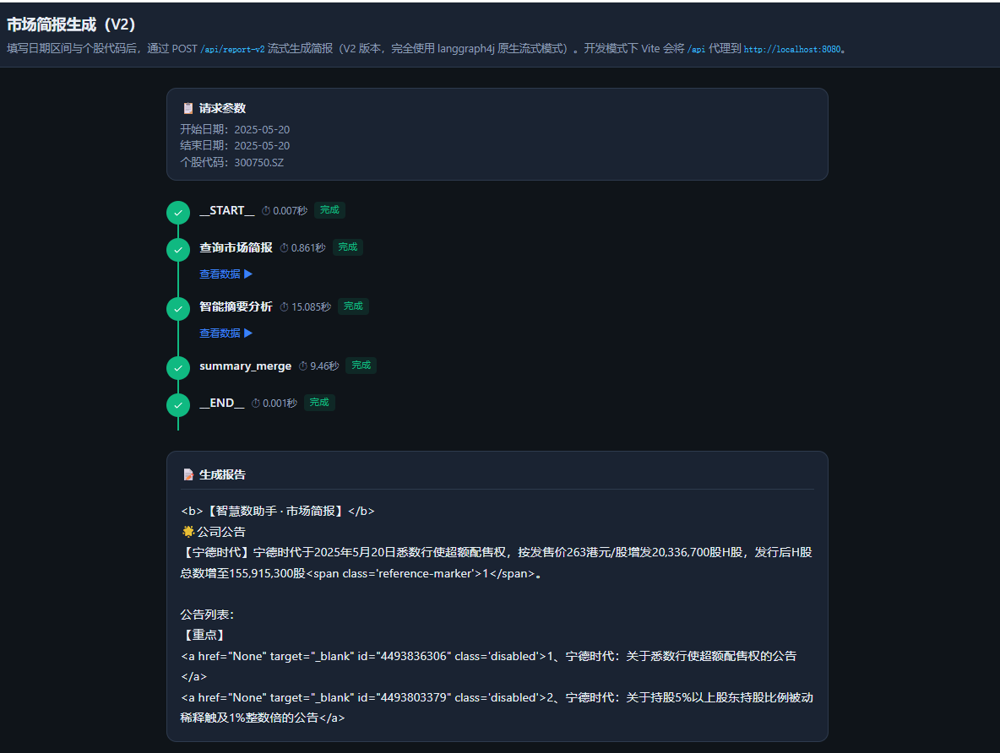
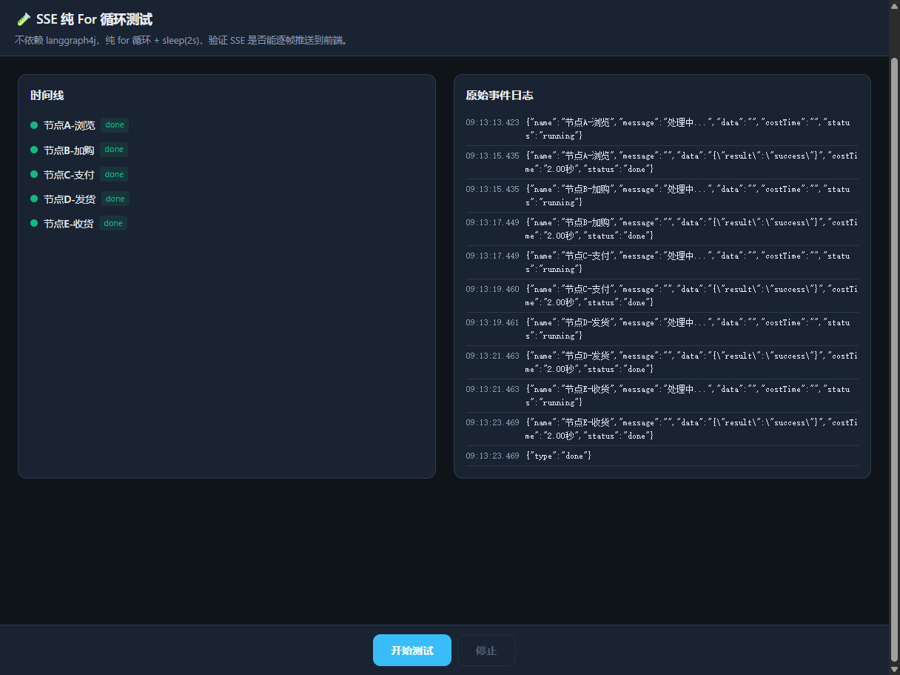
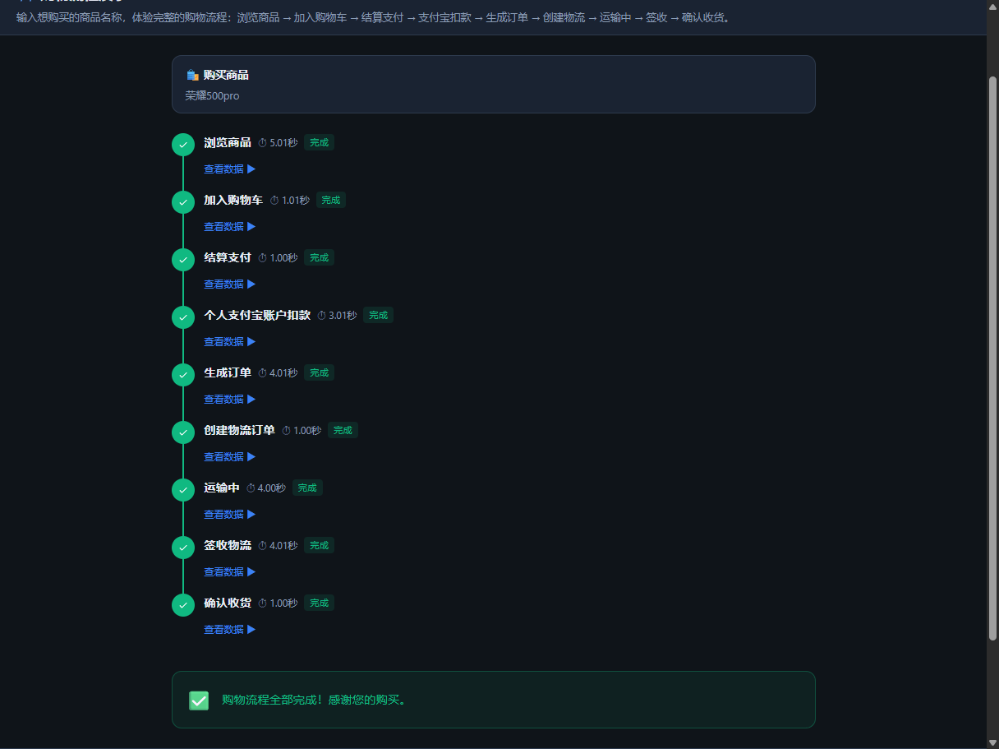

# langgraph4j-study

关于langgraph4j, langchain4j在spring 环境下的自学案例

自学过程中发现的一些问题

1. 起初使用Flux.create时，只使用了第一个参数，第二个参数使用的是默认值，在观测输出效果时，一直观察不到流式输出，似乎所有数据都在最后1毫秒一次性
   输出。询问了AI改写了很多种方式，发现除非最终的输出节点不在langgraph图中，在图外使用streamChatModel进行输出，才能实现流的效果。
   再后来，翻看Flux的create源码，发现了它的第二个参数居然是 FluxSink.OverflowStrategy.BUFFER，至此发现原因了，原来被缓存了。于是尝试使用了
   FluxSink.OverflowStrategy.IGNORE参数值，太好了，能在页面观察到流式输出了。
2. 在未使用FluxSink.OverflowStrategy.IGNORE时，图中的所有节点都是一次性输出到前端，使用后，各个节点都是按照图的构造进行有序输出了。

    

    

    

